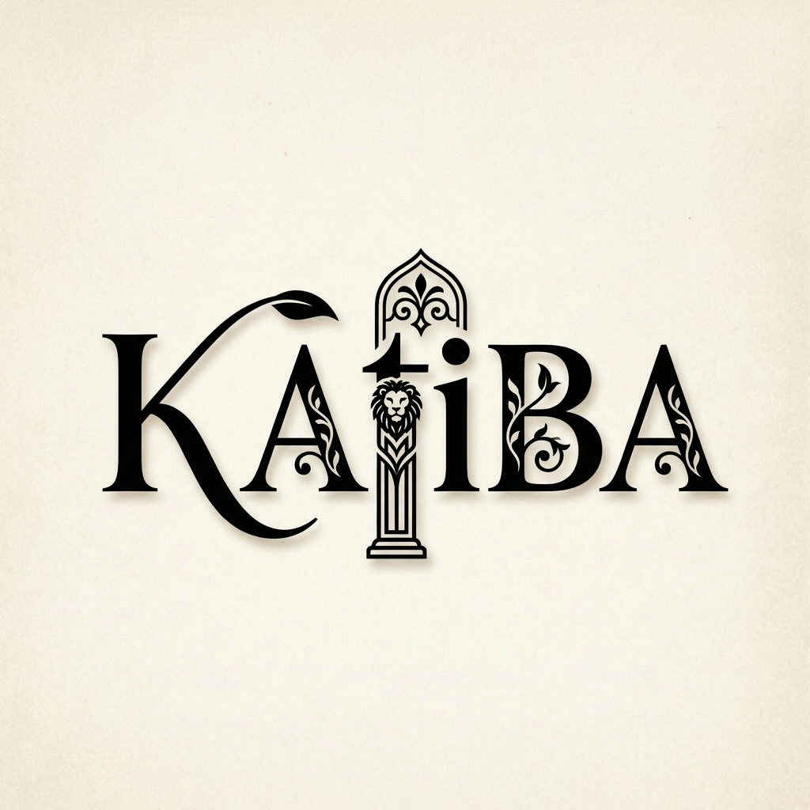

<div align="center">



<h1 style="border-bottom: none">Katiba</h1>

<p><b>Write, draw and plan — all at once.</b></p>
<p>A Persian-friendly fork of <a href="https://github.com/toeverything/AFFiNE">AFFiNE</a>, built to give Iranian users a smoother, more familiar workspace.</p>

<p>
  
  
  
</p>

</div>

> ⚠️ **Beta status:** Katiba is in early beta. It works, but it is not yet optimized for daily use. Expect rough edges, missing polish and breaking changes while we find our footing.

---

## What is Katiba?

[Katiba](https://github.com/ltsmohsen/Katiba) is a fork of [AFFiNE](https://affine.pro) — the open-source, local-first workspace where docs, whiteboards and databases live on one canvas.

Katiba keeps everything AFFiNE is, and focuses it on one audience: **people in Iran** who want a modern workspace that respects their language, typography and everyday constraints.

Out of the box, Katiba aims for:

- Full **Persian (فارسی) interface** with proper **right-to-left** layout
- The **Vazirmatn** typeface bundled and used throughout the UI
- Sensible defaults for Iranian users, without losing anything from upstream
- **Accessible AI** — useful AI features without needing foreign accounts, phone numbers or USD payments
- **Easy sign-in** — authentication that just works, with minimal setup for users and self-hosters alike
- **Easy self-hosting** — a simple, documented path to run your own Katiba server
- **Resilience in internet shutdowns** — a local-first app that keeps working offline and syncs when the connection returns

## Why Katiba instead of Notion?

| | Notion | Katiba |
|---|---|---|
| Offline access | Limited; cloud-first | ✅ Local-first — keeps working offline and in internet shutdowns, syncs later |
| Privacy | Your data on someone else's servers | ✅ You own your data; self-host if you want |
| Availability in Iran | Accounts, billing and access can be a headache | ✅ Free, open-source, no account walls or sanctions friction |
| Persian experience | LTR-first, Persian feels second-class | ✅ RTL-first mindset, Persian font and translations |
| Cost | Free tier with limits, paid plans in USD | ✅ Free forever under the MIT license |
| Openness | Closed source | ✅ Open source — fork it, inspect it, shape it |

In short: Notion rents you a desk in someone else's office. Katiba hands you the keys to your own studio.

## Screenshots

Coming soon — the UI is changing fast during beta. Run it locally and have a look around.

## Getting started

You need **Node.js 22 LTS** and **Yarn** (via Corepack).

```bash
git clone https://github.com/ltsmohsen/Katiba.git
cd Katiba/AFFiNE
yarn install
yarn dev
```

Then open the printed local URL (usually http://localhost:8080) and pick the **web** build when asked.

> These steps track upstream AFFiNE. If anything diverges, upstream docs win until Katiba's own guide lands.

## Relationship with AFFiNE

Katiba is a **fork**, not a rewrite. All credit for the core product goes to the [AFFiNE team and contributors](https://github.com/toeverything/AFFiNE).

- Upstream repository: https://github.com/toeverything/AFFiNE
- The pre-fork README is preserved in this repo as [`README.upstream.md`](README.upstream.md)
- Katiba-specific changes live on the `Katiba` branch

We pull from upstream where it makes sense and diverge where Iranian users need something different.

## Roadmap

- [x] Persian translation of the UI
- [x] Vazirmatn font bundled
- [x] Katiba branding and icons
- [ ] RTL polish across all views (docs, whiteboard, database)
- [ ] Persian-first onboarding and templates
- [ ] Accessible AI without foreign accounts or payments
- [ ] Easy sign-in with minimal setup
- [ ] Easy, documented self-hosting
- [ ] Offline resilience for internet shutdowns (keep working, sync later)
- [ ] Performance and stability pass for daily use
- [ ] Regular upstream merges

Have an idea? Open an issue — Persian or English, both welcome.

## Contributing

Contributions are welcome. If you can translate, test, design or write code, there is room for you.

1. Fork the repo and branch off `Katiba`
2. Make your change
3. Open a pull request describing what and why

Please keep pull requests focused and small while we are in beta.

## License

Same licensing as the original AFFiNE project — see [`LICENSE`](LICENSE) and [`LICENSE-MIT`](LICENSE-MIT). In short: the bulk of the codebase is available under the **MIT license**; parts under `packages/backend` and `packages/common/native` follow the backend server license, and third-party components keep their own licenses.

---

<div align="center">
<sub>Built with care in the open · Katiba is a community fork and is not affiliated with AFFiNE or Notion.</sub>
</div>
